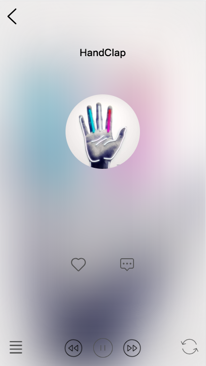

#前言
> 
技术栈
Vue+Vuex+Vue-resource+Vant+Scss
##实现功能
*搜索功能，包括搜索歌曲和歌手
*歌曲的播放，暂停功能
*歌曲单曲,列表播放
*喜欢歌曲列表，添加删除

##还未实现
*歌曲播放历史
*进度条
## Build Setup

``` bash
# install dependencies
npm install

# serve with hot reload at localhost:8080
npm run dev

# build for production with minification
npm run build

# build for production and view the bundle analyzer report
npm run build --report
```

## 部分效果图
### 首页和播放页



### 搜索功能和喜欢列表


